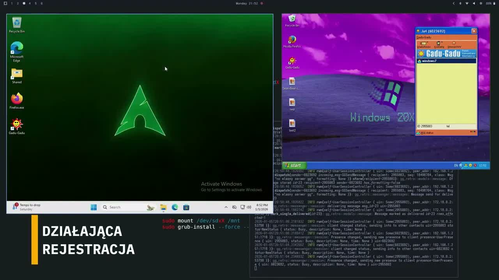

<p align="center">
  
</p>

# GG-Retro

Reimplementacja serwera protokołu Gadu-Gadu 6.0 w języku Rust. Projekt umożliwia uruchomienie własnego serwera kompatybilnego z oryginalnym klientem GG 6.0.

## Demo

[](https://youtu.be/wgpId9a4DRE)

## Funkcje

- Logowanie i rejestracja użytkowników
- Wysyłanie i odbieranie wiadomości
- Statusy online/offline/zajęty/niewidoczny
- Kolejkowanie wiadomości offline
- Formatowanie tekstu (pogrubieni3

## Wymagania

- Rust 1.90+
- SQLite
- [Klient Gadu-Gadu 6.0](https://www.dobreprogramy.pl/gadu-gadu-gg,program,windows,6628204058663041)

## Testowanie

```bash
# Wszystkie testy
cargo test

# Testy protokołu
cargo test -p gg-protocol

# Testy serwera
cargo test -p gg-server
```

## Budowanie pakietów

### Linux (.deb)

```bash
make amd64   # x86_64
make rpi64   # Raspberry Pi 64-bit (Pi 3/4/5)
make rpi32   # Raspberry Pi 32-bit (Pi 2/3/4)
make linux   # wszystkie architektury Linux
make deb     # wszystkie pakiety .deb
```

### Windows (.exe)

```bash
make win64   # Windows 64-bit (Windows 7+)
make win32   # Windows 32-bit (Windows 7+, działa na 32-bit i 64-bit)
make windows # obie wersje Windows
```

Wymagania: Windows 7 lub nowszy. Wersja 32-bit działa na wszystkich systemach Windows.

### macOS

```bash
make macos-intel  # macOS Intel (macOS 10.12+)
make macos-arm    # macOS Apple Silicon M1/M2/M3 (macOS 11+)
make macos        # obie wersje macOS
```

**Uwaga:** Budowanie dla macOS wymaga natywnego Maca lub GitHub Actions z macos-runner.

### Wszystkie platformy

```bash
make all     # Linux + Windows
make clean   # czyszczenie
```

Pakiety znajdziesz w katalogu `dist/`.

Wymagane narzędzia (`cross`, `cargo-deb`) instalują się automatycznie.

### Instalacja pakietu

```bash
sudo dpkg -i dist/gg-retro_*.deb

# Uruchomienie serwera
sudo systemctl start gg-retro

# Włączenie autostartu
sudo systemctl enable gg-retro
```

| Ścieżka | Opis |
|---------|------|
| `/etc/gg-retro/config.toml` | Konfiguracja |
| `/var/lib/gg-retro/gg.db` | Baza danych |
| `journalctl -u gg-retro` | Logi |

### Uruchomienie na Windows

```cmd
gg-retro_win64.exe
```

Lub z konfiguracją przez zmienne środowiskowe:

```cmd
set GG_BIND=0.0.0.0
set GG_HTTP_PORT=8080
gg-retro_win64.exe
```

Plik konfiguracyjny `config.toml` powinien znajdować się w tym samym katalogu co plik `.exe`.

**Uwaga:** Port 80 wymaga uprawnień administratora. Użyj `GG_HTTP_PORT=8080` dla zwykłego użytkownika.

### Uruchomienie na macOS

```bash
./gg-retro_macos_arm   # Apple Silicon
./gg-retro_macos_intel # Intel Mac
```

Konfiguracja analogiczna jak na Linux (zmienne środowiskowe lub `config.toml`).

## Uruchamianie

### Serwer

```bash
cargo run --bin gg-server
```

Serwer nasłuchuje na:
- Port 8074: Protokół GG (TCP)
- Port 80: API HTTP (rejestracja, CAPTCHA, discovery)

## Konfiguracja serwera

Serwer może być konfigurowany na trzy sposoby (w kolejności priorytetów):

### 1. Zmienne środowiskowe (najwyższy priorytet)

```bash
GG_BIND=0.0.0.0 GG_HTTP_PORT=8080 GG_GG_PORT=8074 GG_DB=./gg.db cargo run --bin gg-retro
```

### 2. Plik `config.toml`

Stwórz plik `config.toml` w katalogu głównym projektu:

```toml
bind = "0.0.0.0"
http_port = 80
gg_port = 8074
db = "./gg.db"
hostname = "gg-retro.local"
```

### 3. Wartości domyślne (najniższy priorytet)

Jeśli nie podano żadnej konfiguracji, serwer użyje wartości domyślnych:
- `bind`: `0.0.0.0` - nasłuchiwanie na wszystkich interfejsach
- `http_port`: `80` - port HTTP API
- `gg_port`: `8074` - port protokołu GG
- `db`: `./gg.db` - ścieżka do bazy danych SQLite
- `hostname`: `gg-retro.local` - nazwa hosta serwera

**Uwaga:** Zmienne środowiskowe nadpisują ustawienia z pliku, a plik nadpisuje wartości domyślne.

### Klient testowy

```bash
cargo run --bin gg-client
```

## Pobieranie klienta GG

Klient Gadu-Gadu 6.1 jest dostępny do pobrania ze strony serwera GG-Retro (zakładka "Pobierz").

### Weryfikacja sumy kontrolnej

```
SHA256: bcc8157aa6bface009d8018c308bf3cef8725546b4f826bdbaf6bbeaa953b06f  gg61.exe
```

**Windows (PowerShell):**
```powershell
Get-FileHash gg61.exe -Algorithm SHA256
```

**Linux/macOS:**
```bash
sha256sum gg61.exe
```

## Konfiguracja klienta GG

Aby połączyć oryginalnego klienta GG 6.0 z własnym serwerem, masz dwie opcje:

### Opcja 1: Plik hosts

Dodaj wpisy do pliku hosts:

**Windows:** `C:\Windows\System32\drivers\etc\hosts`
**Linux/Mac:** `/etc/hosts`

```
127.0.0.1  appmsg.gadu-gadu.pl
127.0.0.1  appsrv.gadu-gadu.pl
127.0.0.1  register.gadu-gadu.pl
```

**Uwaga:** Po zmianie wpisów wyczyść cache rejestru GG - klient cachuje adresy serwerów.

### Opcja 2: Patchowanie pliku wykonywalnego (zalecane)

Użyj wbudowanego patchera na stronie głównej serwera (zakładka "Patcher").

Patcher zamienia domenę `gadu-gadu.pl` na Twoją domenę (max 12 znaków) bezpośrednio w przeglądarce - plik nie jest wysyłany na serwer.

**Wymagania:**
- Serwer GG-Retro musi być uruchomiony na porcie 80 (HTTP API)
- Musisz mieć skonfigurowaną domenę wskazującą na serwer
- Domenę możesz ustawić w:
  - Pliku `/etc/hosts` (Linux/Mac) lub `C:\Windows\System32\drivers\etc\hosts` (Windows)
  - Pi-hole (jeśli używasz lokalnego DNS)
  - Lokalnym serwerze DNS

Przykładowa konfiguracja domeny w `/etc/hosts`:
```
192.168.1.100  gg-retro.local
```

**Patchowanie:**

1. Otwórz stronę serwera GG-Retro (np. `http://gg-retro.local`)
2. Przejdź do zakładki "Patcher"
3. Wybierz plik `gg.exe`
4. Wpisz adres serwera (np. `gg-retro.local`)
5. Kliknij "Patchuj plik"
6. Pobierz spatchowany plik

## Uruchamianie GG 6.0 na Linuxie (Wine)

### Instalacja Wine

**Arch/Manjaro:**
```bash
sudo pacman -S wine winetricks
```

**Ubuntu/Debian:**
```bash
sudo apt install wine winetricks
```

**Fedora:**
```bash
sudo dnf install wine winetricks
```

### Konfiguracja

Stwórz dedykowany prefix Wine i ustaw Windows XP:

```bash
WINEPREFIX=~/.wine-xp winecfg
```

W oknie konfiguracji wybierz **Windows XP**, zamknij.

### Instalacja komponentów IE

GG używa wbudowanego Internet Explorera do wyświetlania HTML:

```bash
WINEPREFIX=~/.wine-xp winetricks ie8
```

Jeśli ie8 sprawia problemy, spróbuj ie6:

```bash
WINEPREFIX=~/.wine-xp winetricks ie6
```

Dodatkowe komponenty:

```bash
WINEPREFIX=~/.wine-xp winetricks mshtml riched20 riched30
```

### Uruchomienie

```bash
WINEPREFIX=~/.wine-xp wine gg_patched.exe
```

## Struktura projektu

```
gg-retro/
├── protocol/     # Implementacja protokołu GG
├── server/       # Serwer GG (TCP + HTTP + patcher webowy)
├── client/       # Klient testowy
└── docs/         # Dokumentacja protokołu
```

## Reklamy
- 222x33
- 400x50

## Baza danych

Serwer używa SQLite. Plik bazy: `./gg.db`

Migracje uruchamiają się automatycznie przy starcie serwera.

## Czego brakuje

- Wysyłanie obrazków (GG 6.0 używa DCC, nie przechodzi przez serwer)
- Publiczny katalog użytkowników
- Przypomnienie hasła (email)

## Dokumentacja protokołu

Pełna dokumentacja protokołu GG znajduje się w `docs/protocol.md` (po polsku).

Przydatne źródło: https://libgadu.net/protocol/

## Licencja

MIS License - zobacz plik [LICENSE](LICENSE)
