# Gadu-Gadu 6.0 Protocol Flows

Sequence diagrams for the Gadu-Gadu 6.0 protocol based on `protocol.md`.

## Table of Contents

1. [Server Discovery](#server-discovery)
2. [Authentication](#authentication)
3. [Contact List](#contact-list)
4. [Status Changes](#status-changes)
5. [Messaging](#messaging)
6. [Keep-Alive](#keep-alive)
7. [Disconnection](#disconnection)
8. [Public Directory](#public-directory)
9. [Server-side Contact List](#server-side-contact-list)
10. [Direct Connections (DCC)](#direct-connections-dcc)

---

## Server Discovery

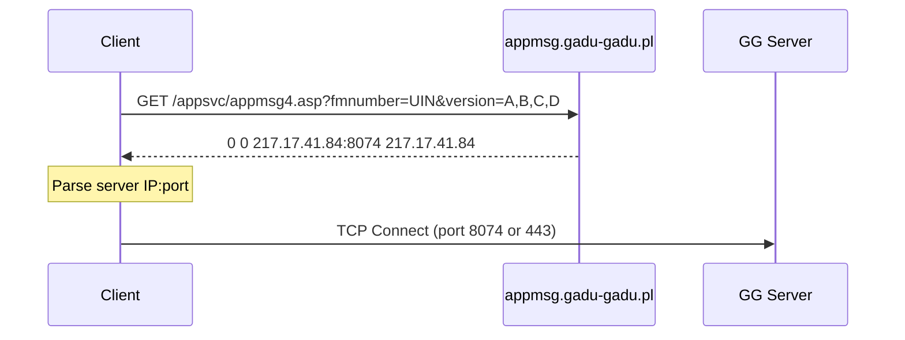
```mermaid
sequenceDiagram
    participant C as Client
    participant H as appmsg.gadu-gadu.pl
    participant S as GG Server

    C->>H: GET /appsvc/appmsg4.asp?fmnumber=UIN&version=A,B,C,D
    H-->>C: 0 0 217.17.41.84:8074 217.17.41.84
    Note over C: Parse server IP:port
    C->>S: TCP Connect (port 8074 or 443)
```

---

## Authentication

### Login Flow

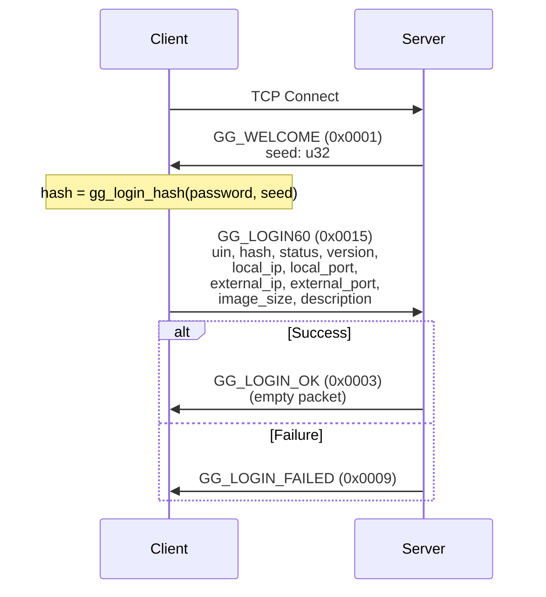
```mermaid
sequenceDiagram
    participant C as Client
    participant S as Server

    C->>S: TCP Connect
    S->>C: GG_WELCOME (0x0001)<br/>seed: u32

    Note over C: hash = gg_login_hash(password, seed)

    C->>S: GG_LOGIN60 (0x0015)<br/>uin, hash, status, version,<br/>local_ip, local_port,<br/>external_ip, external_port,<br/>image_size, description

    alt Success
        S->>C: GG_LOGIN_OK (0x0003)<br/>(empty packet)
    else Failure
        S->>C: GG_LOGIN_FAILED (0x0009)
    end
```

### Password Hash Algorithm

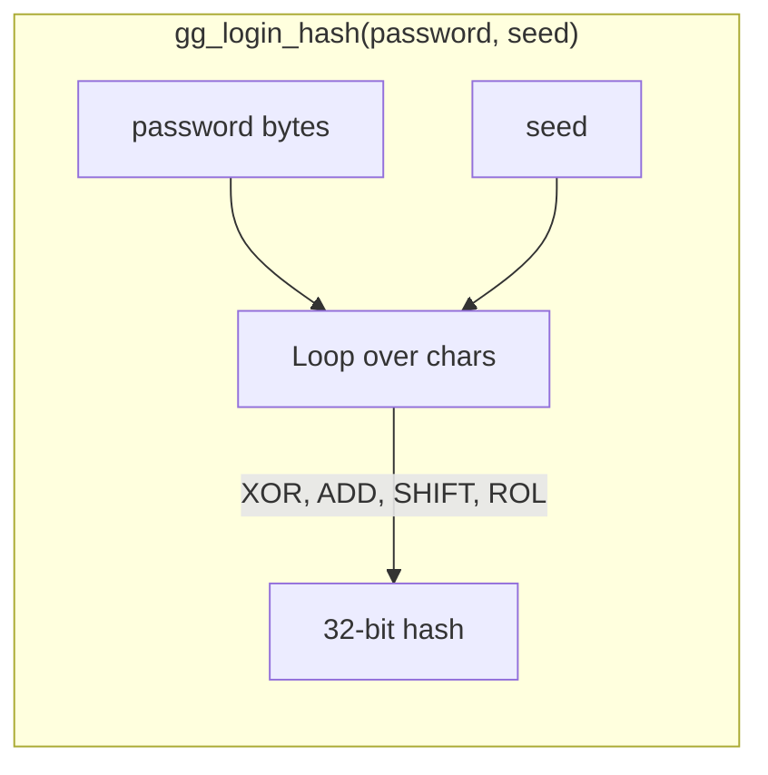
```mermaid
flowchart LR
    subgraph "gg_login_hash(password, seed)"
        P[password bytes] --> L[Loop over chars]
        SE[seed] --> L
        L --> |XOR, ADD, SHIFT, ROL| H[32-bit hash]
    end
```

---

## Contact List

### Sending Contact List

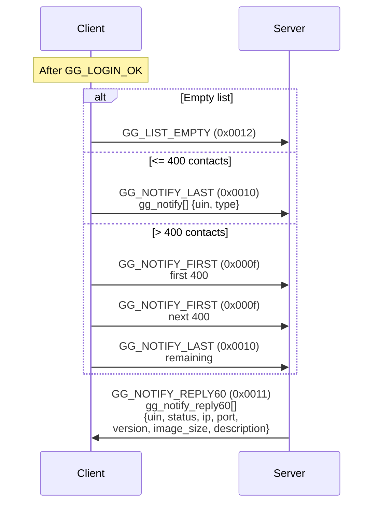
```mermaid
sequenceDiagram
    participant C as Client
    participant S as Server

    Note over C: After GG_LOGIN_OK

    alt Empty list
        C->>S: GG_LIST_EMPTY (0x0012)
    else <= 400 contacts
        C->>S: GG_NOTIFY_LAST (0x0010)<br/>gg_notify[] {uin, type}
    else > 400 contacts
        C->>S: GG_NOTIFY_FIRST (0x000f)<br/>first 400
        C->>S: GG_NOTIFY_FIRST (0x000f)<br/>next 400
        C->>S: GG_NOTIFY_LAST (0x0010)<br/>remaining
    end

    S->>C: GG_NOTIFY_REPLY60 (0x0011)<br/>gg_notify_reply60[]<br/>{uin, status, ip, port,<br/>version, image_size, description}
```

### User Types

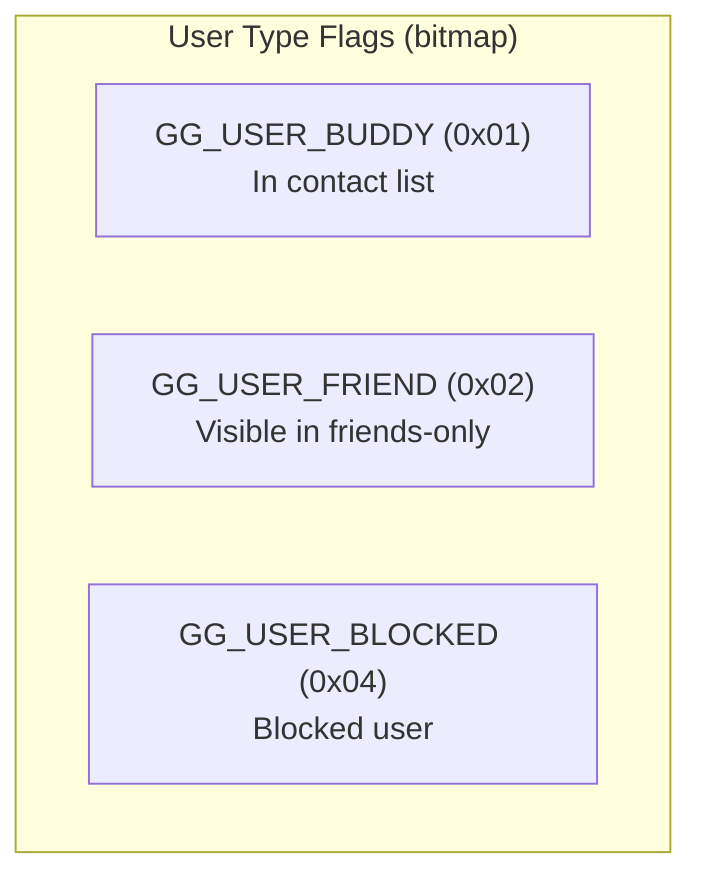
```mermaid
flowchart TB
    subgraph "User Type Flags (bitmap)"
        B["GG_USER_BUDDY (0x01)<br/>In contact list"]
        F["GG_USER_FRIEND (0x02)<br/>Visible in friends-only"]
        BL["GG_USER_BLOCKED (0x04)<br/>Blocked user"]
    end
```

### Adding/Removing Contacts

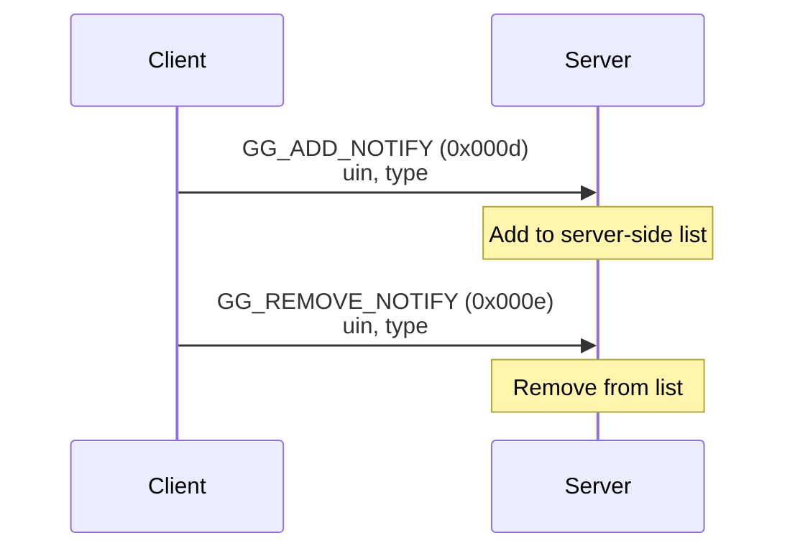
```mermaid
sequenceDiagram
    participant C as Client
    participant S as Server

    C->>S: GG_ADD_NOTIFY (0x000d)<br/>uin, type
    Note over S: Add to server-side list

    C->>S: GG_REMOVE_NOTIFY (0x000e)<br/>uin, type
    Note over S: Remove from list
```

---

## Status Changes

### Changing Own Status

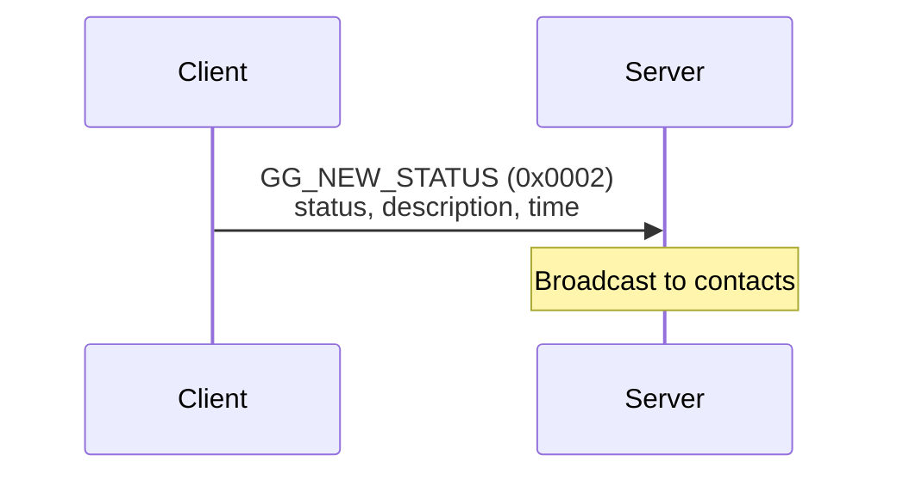
```mermaid
sequenceDiagram
    participant C as Client
    participant S as Server

    C->>S: GG_NEW_STATUS (0x0002)<br/>status, description, time

    Note over S: Broadcast to contacts
```

### Receiving Status Updates

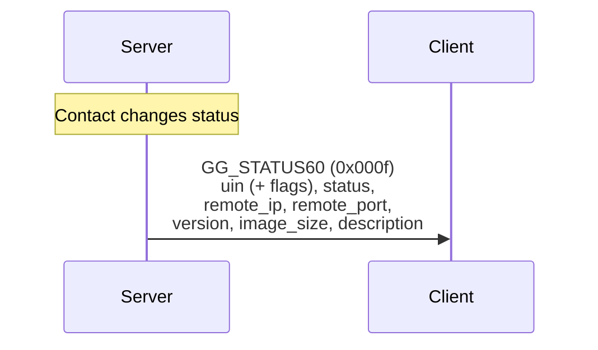
```mermaid
sequenceDiagram
    participant S as Server
    participant C as Client

    Note over S: Contact changes status
    S->>C: GG_STATUS60 (0x000f)<br/>uin (+ flags), status,<br/>remote_ip, remote_port,<br/>version, image_size, description
```

### Status Values

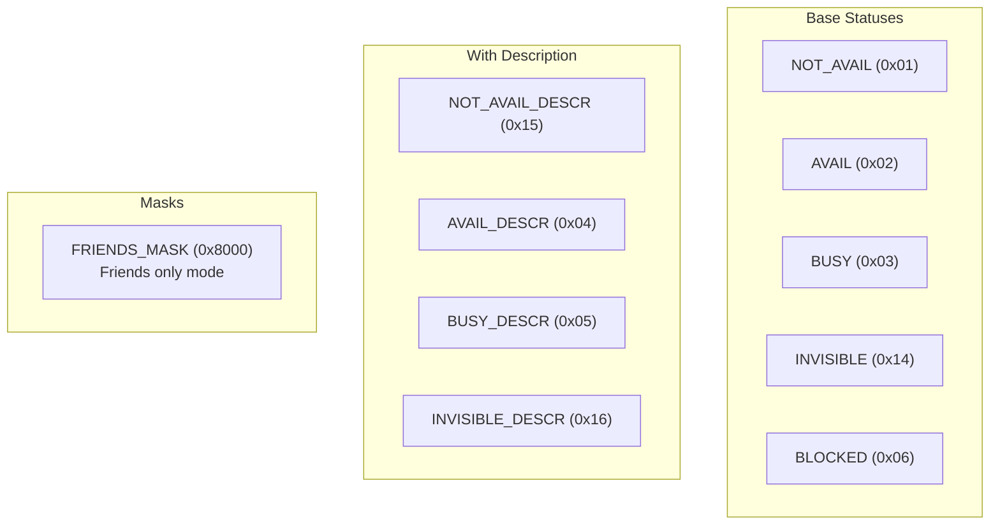
```mermaid
flowchart TB
    subgraph "Base Statuses"
        NA["NOT_AVAIL (0x01)"]
        AV["AVAIL (0x02)"]
        BU["BUSY (0x03)"]
        INV["INVISIBLE (0x14)"]
        BLK["BLOCKED (0x06)"]
    end

    subgraph "With Description"
        NAD["NOT_AVAIL_DESCR (0x15)"]
        AVD["AVAIL_DESCR (0x04)"]
        BUD["BUSY_DESCR (0x05)"]
        INVD["INVISIBLE_DESCR (0x16)"]
    end

    subgraph "Masks"
        FM["FRIENDS_MASK (0x8000)<br/>Friends only mode"]
    end
```

### UIN Flags (high byte)

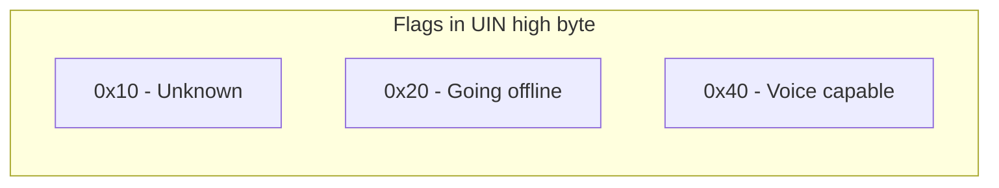
```mermaid
flowchart LR
    subgraph "Flags in UIN high byte"
        U1["0x10 - Unknown"]
        U2["0x20 - Going offline"]
        V["0x40 - Voice capable"]
    end
```

---

## Messaging

### Sending Message

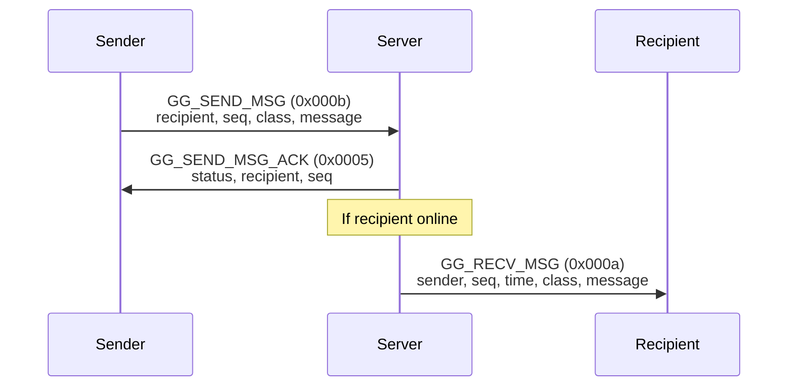
```mermaid
sequenceDiagram
    participant C as Sender
    participant S as Server
    participant R as Recipient

    C->>S: GG_SEND_MSG (0x000b)<br/>recipient, seq, class, message

    S->>C: GG_SEND_MSG_ACK (0x0005)<br/>status, recipient, seq

    Note over S: If recipient online
    S->>R: GG_RECV_MSG (0x000a)<br/>sender, seq, time, class, message
```

### Message Classes

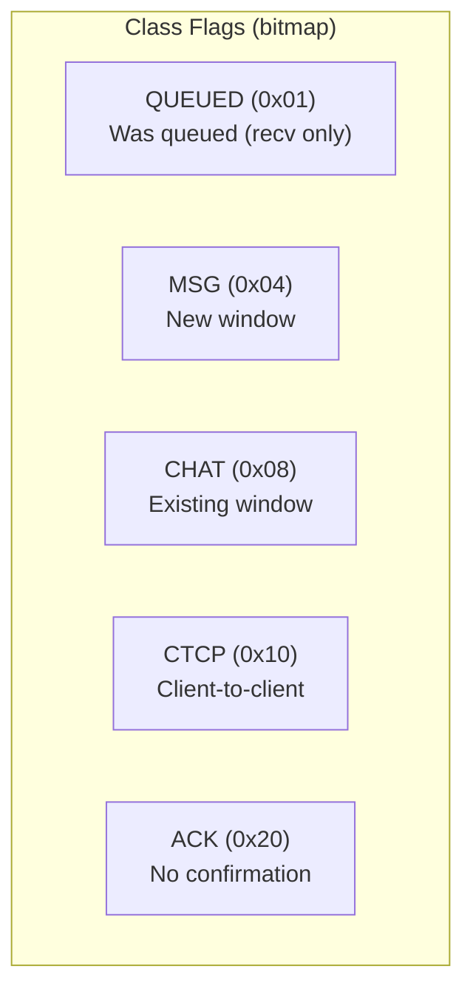
```mermaid
flowchart TB
    subgraph "Class Flags (bitmap)"
        Q["QUEUED (0x01)<br/>Was queued (recv only)"]
        M["MSG (0x04)<br/>New window"]
        CH["CHAT (0x08)<br/>Existing window"]
        CT["CTCP (0x10)<br/>Client-to-client"]
        A["ACK (0x20)<br/>No confirmation"]
    end
```

### ACK Statuses

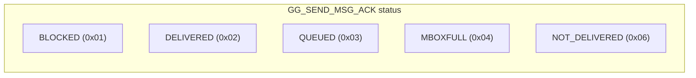
```mermaid
flowchart LR
    subgraph "GG_SEND_MSG_ACK status"
        B["BLOCKED (0x01)"]
        D["DELIVERED (0x02)"]
        Q["QUEUED (0x03)"]
        F["MBOXFULL (0x04)"]
        N["NOT_DELIVERED (0x06)"]
    end
```

### Conference Messages

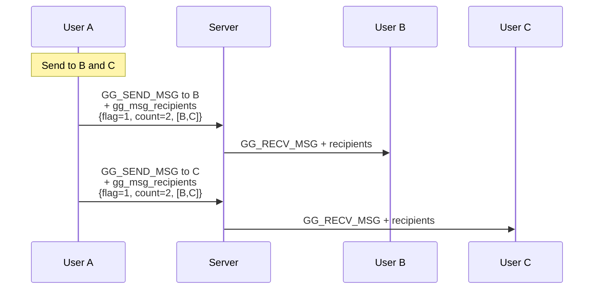
```mermaid
sequenceDiagram
    participant A as User A
    participant S as Server
    participant B as User B
    participant C as User C

    Note over A: Send to B and C

    A->>S: GG_SEND_MSG to B<br/>+ gg_msg_recipients<br/>{flag=1, count=2, [B,C]}
    S->>B: GG_RECV_MSG + recipients

    A->>S: GG_SEND_MSG to C<br/>+ gg_msg_recipients<br/>{flag=1, count=2, [B,C]}
    S->>C: GG_RECV_MSG + recipients
```

### Rich Text Formatting

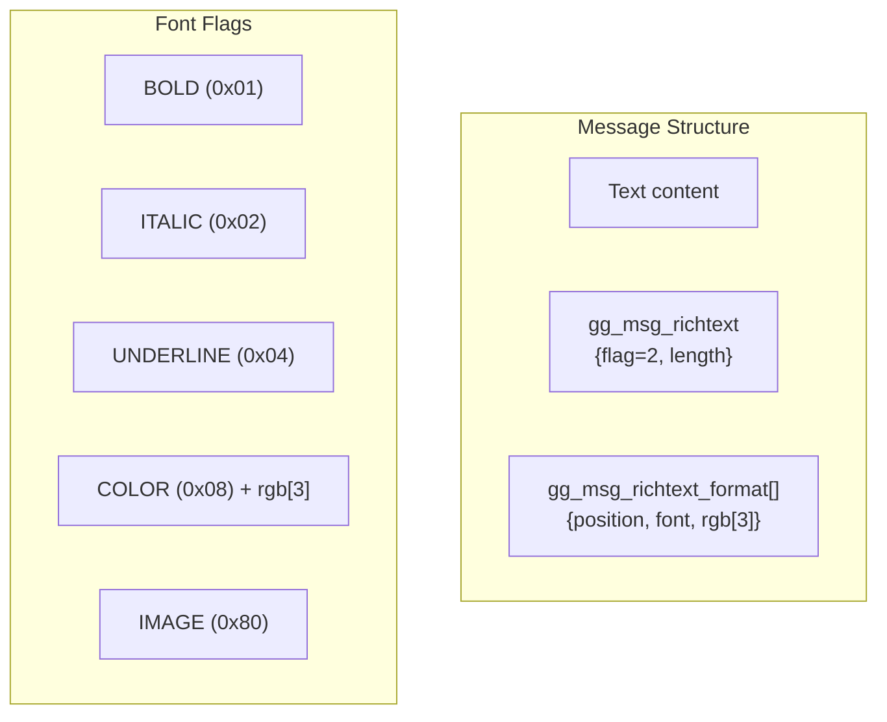
```mermaid
flowchart TB
    subgraph "Message Structure"
        T[Text content]
        RT["gg_msg_richtext<br/>{flag=2, length}"]
        F["gg_msg_richtext_format[]<br/>{position, font, rgb[3]}"]
    end

    subgraph "Font Flags"
        B["BOLD (0x01)"]
        I["ITALIC (0x02)"]
        U["UNDERLINE (0x04)"]
        C["COLOR (0x08) + rgb[3]"]
        IM["IMAGE (0x80)"]
    end
```

### Image Exchange

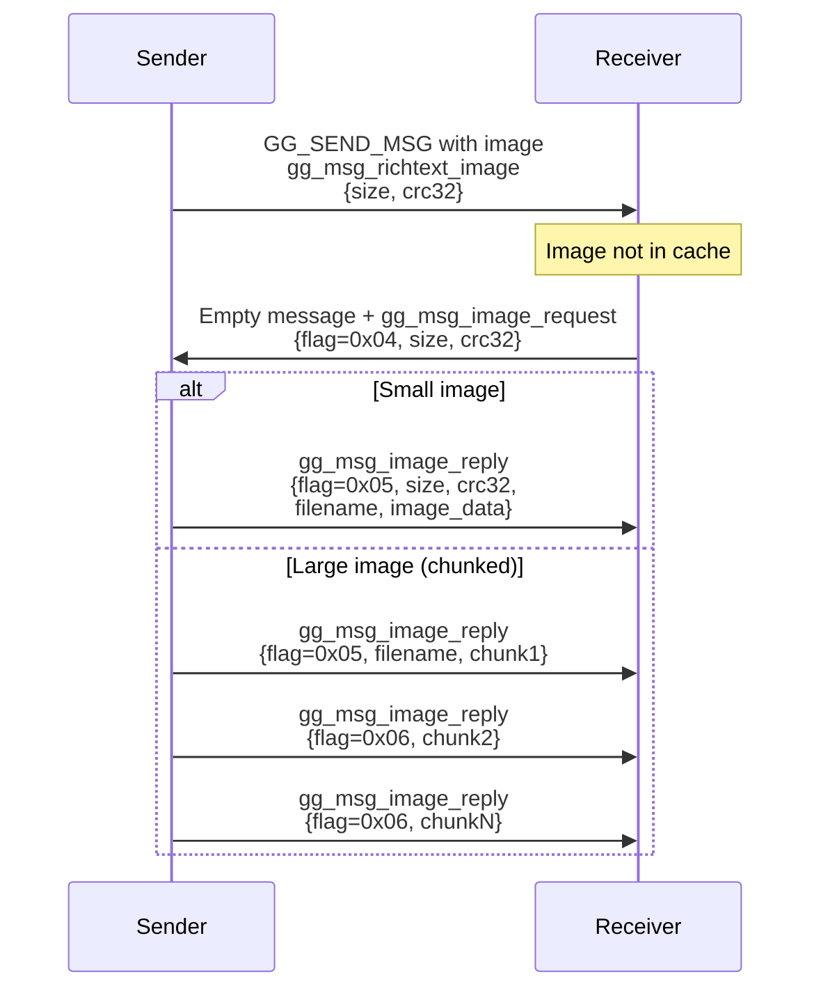
```mermaid
sequenceDiagram
    participant A as Sender
    participant B as Receiver

    A->>B: GG_SEND_MSG with image<br/>gg_msg_richtext_image<br/>{size, crc32}

    Note over B: Image not in cache
    B->>A: Empty message + gg_msg_image_request<br/>{flag=0x04, size, crc32}

    alt Small image
        A->>B: gg_msg_image_reply<br/>{flag=0x05, size, crc32,<br/>filename, image_data}
    else Large image (chunked)
        A->>B: gg_msg_image_reply<br/>{flag=0x05, filename, chunk1}
        A->>B: gg_msg_image_reply<br/>{flag=0x06, chunk2}
        A->>B: gg_msg_image_reply<br/>{flag=0x06, chunkN}
    end
```

---

## Keep-Alive

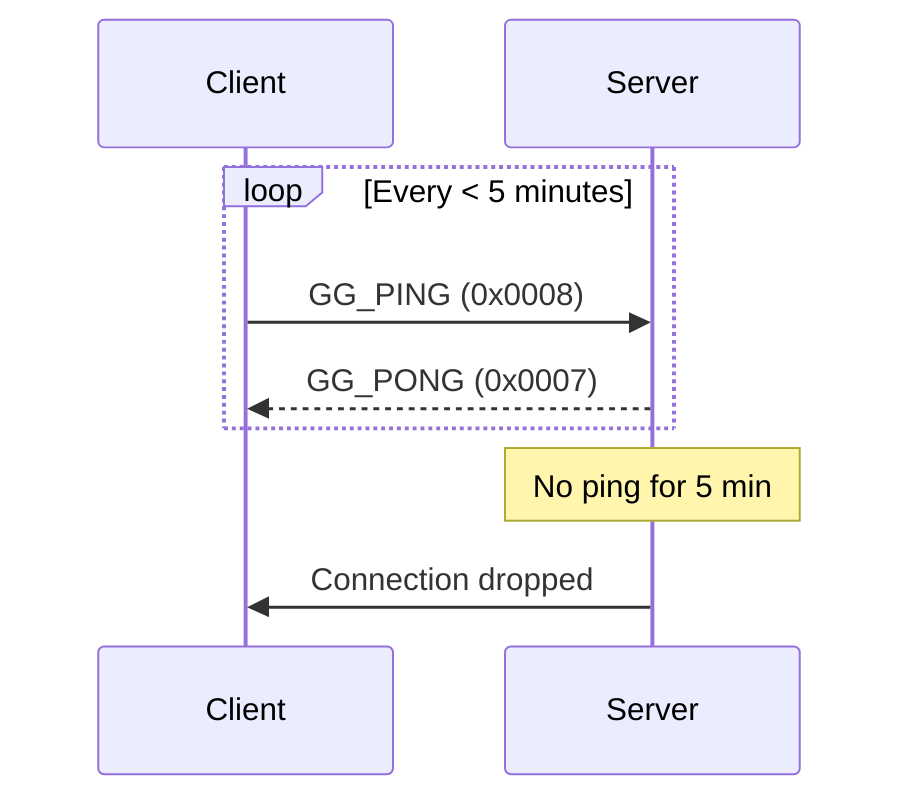
```mermaid
sequenceDiagram
    participant C as Client
    participant S as Server

    loop Every < 5 minutes
        C->>S: GG_PING (0x0008)
        S-->>C: GG_PONG (0x0007)
    end

    Note over S: No ping for 5 min
    S->>C: Connection dropped
```

---

## Disconnection

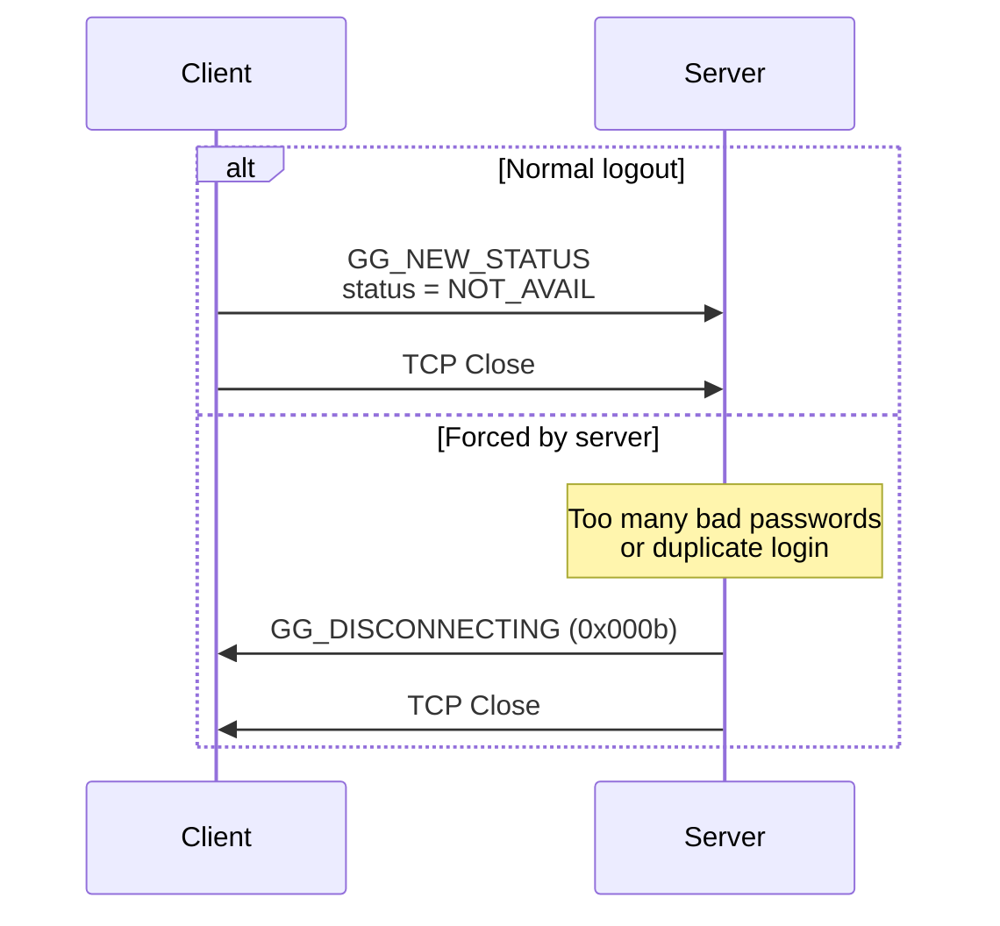
```mermaid
sequenceDiagram
    participant C as Client
    participant S as Server

    alt Normal logout
        C->>S: GG_NEW_STATUS<br/>status = NOT_AVAIL
        C->>S: TCP Close
    else Forced by server
        Note over S: Too many bad passwords<br/>or duplicate login
        S->>C: GG_DISCONNECTING (0x000b)
        S->>C: TCP Close
    end
```

---

## Public Directory

### Search/Read/Write

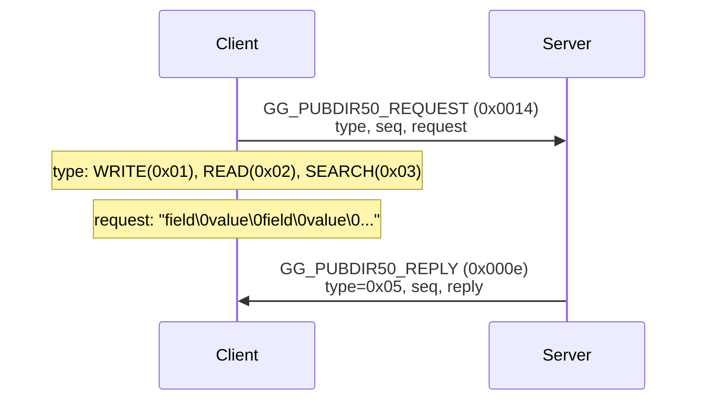
```mermaid
sequenceDiagram
    participant C as Client
    participant S as Server

    C->>S: GG_PUBDIR50_REQUEST (0x0014)<br/>type, seq, request

    Note over C: type: WRITE(0x01), READ(0x02), SEARCH(0x03)
    Note over C: request: "field\0value\0field\0value\0..."

    S->>C: GG_PUBDIR50_REPLY (0x000e)<br/>type=0x05, seq, reply
```

### Search Parameters

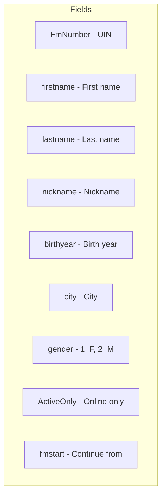
```mermaid
flowchart TB
    subgraph "Fields"
        U["FmNumber - UIN"]
        FN["firstname - First name"]
        LN["lastname - Last name"]
        NN["nickname - Nickname"]
        BY["birthyear - Birth year"]
        CT["city - City"]
        G["gender - 1=F, 2=M"]
        A["ActiveOnly - Online only"]
        ST["fmstart - Continue from"]
    end
```

---

## Server-side Contact List

### Import/Export

```mermaid
sequenceDiagram
    participant C as Client
    participant S as Server

    Note over C: Export (PUT)
    C->>S: GG_USERLIST_REQUEST (0x0016)<br/>type=PUT(0x00), chunk1
    C->>S: GG_USERLIST_REQUEST<br/>type=PUT_MORE(0x01), chunk2
    S->>C: GG_USERLIST_REPLY (0x0010)<br/>type=PUT_REPLY(0x00)

    Note over C: Import (GET)
    C->>S: GG_USERLIST_REQUEST<br/>type=GET(0x02)
    S->>C: GG_USERLIST_REPLY<br/>type=GET_MORE_REPLY(0x04), chunk1
    S->>C: GG_USERLIST_REPLY<br/>type=GET_REPLY(0x06), chunkN
```

### CSV Format

```
firstname;lastname;nickname;display;phone;group;uin;email;available;sound_path;msg;sound_path2;hide;home_phone
```

---

## Direct Connections (DCC)

### Connection Establishment

```mermaid
sequenceDiagram
    participant A as Initiator
    participant B as Receiver

    Note over A: Request via CTCP
    A->>B: GG_SEND_MSG class=CTCP<br/>message = 0x02

    Note over B: Accept and connect
    B->>A: TCP Connect to A's IP:port

    A->>B: gg_dcc_welcome<br/>{uin, peer_uin}
    B->>A: gg_dcc_welcome_ack<br/>{ack = 0x47414455 "UDAG"}

    A->>B: gg_dcc_direction<br/>{type = OUT(0x03)}
    B->>A: gg_dcc_direction<br/>{type = IN(0x02)}
```

### File Transfer

```mermaid
sequenceDiagram
    participant S as Sender
    participant R as Receiver

    Note over S,R: After DCC handshake

    S->>R: GG_DCC_REQUEST_SEND (0x0001)
    S->>R: GG_DCC_FILE_INFO (0x0003)<br/>{file_info structure}

    R->>S: GG_DCC_SEND_ACK (0x0006)<br/>{offset for resume}

    loop File chunks (4096 bytes)
        S->>R: GG_DCC_SEND_DATA (0x0003)<br/>{length, data[]}
    end
    S->>R: GG_DCC_SEND_DATA_LAST (0x0002)<br/>{length, final_data[]}
```

### Voice Call

```mermaid
sequenceDiagram
    participant A as Caller
    participant B as Callee

    Note over A,B: After DCC handshake

    A->>B: GG_DCC_REQUEST_VOICE (0x0002)
    B->>A: GG_DCC_VOICE_ACK (0x01)

    loop Audio stream (GSM codec)
        A->>B: GG_DCC_VOICE_DATA (0x03)<br/>{length, gsm_frames[]}
        B->>A: GG_DCC_VOICE_DATA (0x03)<br/>{length, gsm_frames[]}
    end

    A->>B: GG_DCC_VOICE_TERMINATE (0x04)
```

---

## Packet Index

### Client → Server

| Code | Name | Description |
|------|------|-------------|
| `0x0002` | GG_NEW_STATUS | Change status |
| `0x0007` | GG_PONG | Pong |
| `0x0008` | GG_PING | Ping |
| `0x000b` | GG_SEND_MSG | Send message |
| `0x000d` | GG_ADD_NOTIFY | Add contact |
| `0x000e` | GG_REMOVE_NOTIFY | Remove contact |
| `0x000f` | GG_NOTIFY_FIRST | Contact list (start) |
| `0x0010` | GG_NOTIFY_LAST | Contact list (end) |
| `0x0012` | GG_LIST_EMPTY | Empty contact list |
| `0x0014` | GG_PUBDIR50_REQUEST | Public directory |
| `0x0015` | GG_LOGIN60 | Login |
| `0x0016` | GG_USERLIST_REQUEST | Server contact list |

### Server → Client

| Code | Name | Description |
|------|------|-------------|
| `0x0001` | GG_WELCOME | Login seed |
| `0x0003` | GG_LOGIN_OK | Login success |
| `0x0005` | GG_SEND_MSG_ACK | Message ACK |
| `0x0007` | GG_PONG | Pong |
| `0x0009` | GG_LOGIN_FAILED | Login failed |
| `0x000a` | GG_RECV_MSG | Received message |
| `0x000b` | GG_DISCONNECTING | Forced disconnect |
| `0x000e` | GG_PUBDIR50_REPLY | Directory reply |
| `0x000f` | GG_STATUS60 | Contact status |
| `0x0010` | GG_USERLIST_REPLY | Contact list reply |
| `0x0011` | GG_NOTIFY_REPLY60 | Contact statuses |